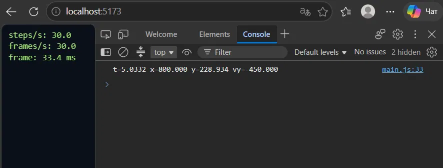

# Dogfight

Короткий опис: космічний корабель, який літає по арені. Керування: ←/→ або A/D поворот, ↑ або W тяга.

## Як запустити
npm install
npm run dev

## Тюнінг

| Параметр | Було | Стало | Чому                                                                                                                                            |
|---|------|-------|-------------------------------------------------------------------------------------------------------------------------------------------------|
| drag | 0.6  | 0.8   | Проби з 0.2 показали, що корабель ковзає кілька кіл перш ніж зупиниться, ним неможливо точно керувати. 0.8 дає помітне, але плавне гальмування. |
| turnSpeed | 3.5  | 4.2   | Значення 4.2 пійшло, оскільки корабель став швидше повертатись.                                                                                 |
| thrust | 450  | 550   | Змінено можливість прискорюватись швидше.                                                                                                       |

Фінальні значення: turnSpeed = 4.2, thrust = 550, drag = 0.8, maxSpeed = 450.

## Вимірювання
Монітор: 60 Гц. steps/s = 60, frames/s = 60 (frame ≈ 16.7 мс)
При низькому заряді батареї (режим енергозбереження) frames/s впало до 30,
але steps/s лишалося 60: акумулятор виконував по 2 кроки фізики за кадр.
Це показує, що симуляція не залежить від частоти кадрів.

## Експеримент 1: блокуючий цикл у render

**Що зробила:** кожен 60-й кадр у render додала busy-wait на 100 мс.

**Результат:**
- frame: раз на секунду пік ~100 мс, інакше 16.7 мс
- frames/s: 60 → 55.4
- steps/s: лишилося 60.0

**Що бачить гравець:** раз на секунду корабель підстрибує/завмирає на мить.

**Пояснення через event loop:** JavaScript виконується в одному потоці.
Поки виконується мій цикл while, стек викликів зайнятий, і event loop
не може взяти наступне завдання: ні rAF-колбек, ні подію клавіатури,
ні таймер. Браузер не може намалювати кадр, бо рендеринг теж чекає на
порожній стек. Тому 100 мс блокування не можна «обійти» всередині того
самого потоку: єдине рішення це не блокувати (розбити роботу на частини
або винести у Web Worker). Steps/s не впали, бо після блокування
накопичений час за один кадр віддається фізиці кількома кроками по 1/60 с.

## Експеримент 2: setInterval замість requestAnimationFrame
**Що зробила:** у loop.js замінила rAF на setInterval з інтервалом 16 мс.

**Результат (10 с спостережень):**
- frames/s: 60.0 (rAF) → 62.2 (setInterval)
- frame: стабільні 16.5-16.7 мс → коливання 15-20 мс
- steps/s: 60.0 → 60.2
- Фонова вкладка (5 с): З setInterval гра у фоні не зупиняється, браузер лише сповільнює таймер (зазвичай до 1 раз на секунду). Після повернення подивіться на HUD: frame ms може показати велике значення, а frames/s на мить просяде.
  З rAF у фоні кадри взагалі не викликаються, економиться процесор і батарея.

**Пояснення:** setInterval ставить колбек у чергу завдань за таймером і не
знає про частоту оновлення екрана. 16 мс ≠ 16,67 мс, тому колбеки то
випереджають малювання, то запізнюються (і ще й чекають, поки стек
звільниться). requestAnimationFrame викликається браузером
рівно перед малюванням (крок рендерингу event loop), тому кадри рівномірні,
а у прихованій вкладці він призупиняється.

## Експеримент 3: змінний крок замість фіксованого

**Що зробила:** спочатку в loop.js прибрала акумулятор, і simulate(dt)
викликався один раз за кадр з dt = реальний час кадру. Для відтворюваності
корабель сам тримає тягу (підмінений input), а в консоль виводиться стан,
коли симуляційний час досягає 5 с. Щоб кадри були довгими, у render додано
busy-wait 30 мс. Також вмикала CPU throttling 6x slowdown у DevTools.
Потім повернула фіксований крок 1/60 с з акумулятором і повторила вимірювання.

**Результати (стан корабля, коли t ≥ 5 с):**

| Режим | HUD (steps/s / frames/s / frame) | Результат |
|---|---|---|
| Змінний крок, без навантаження, запуск 1 | 60 / 60 / 16.7 мс | t=5.0008, y=245.172 |
| Змінний крок, без навантаження, запуск 2 | 60 / 60 / 16.8 мс | t=5.0083, y=241.844 |
| Змінний крок, без навантаження, запуск 3 | 60 / 60 / 16.6 мс | t=5.0001, y=245.515 |
| Змінний крок, навантаження 30 мс, запуск 1 | 30.0 / 30.0 / 33.4 мс | t=5.0332, y=228.934 |
| Змінний крок, навантаження 30 мс, запуск 2 | 30.0 / 30.0 / 33.3 мс | t=5.0165, y=236.465 |
| Змінний крок, навантаження 30 мс, запуск 3 | 29.5 / 29.5 / 33.2 мс | t=5.0166, y=236.291 |
| Фіксований крок, навантаження 30 мс, запуск 1 | 61.0 / 29.5 / 33.4 мс | t=5.0167, y=238.075 |
| Фіксований крок, навантаження 30 мс, запуск 2 | 60.0 / 29.0 / 33.2 мс | t=5.0167, y=238.075 |

**Спостереження:**
- При змінному кроці `t` і `y` щоразу відрізняються, хоча дії однакові:
  `y` коливається від 228.9 до 245.5 (різниця ~16.6 px). Найбільше
  відхилення було при довгих кадрах (t=5.0332), бо симуляція «перестрибує»
  момент t = 5 с на великому кроці dt, і інтегрування дає інший результат.
- При змінному кроці `steps/s` дорівнює `frames/s` (30 і 30): кількість
  кроків фізики прив'язана до частоти кадрів.
- При фіксованому кроці `steps/s` лишається ≈ 60 навіть коли `frames/s`
  упав до ≈ 29: акумулятор виконує по 2 кроки за кадр. Обидва запуски дали
  абсолютно однаковий результат: t=5.0167, y=238.075.

**Висновок:** змінний крок робить симуляцію недетермінованою: результат
залежить від швидкодії комп'ютера, навантаження та моментів, коли
браузер видає кадри. Фіксований крок 1/60 с гарантує однакову послідовність
кроків при будь-якій частоті кадрів, тому однакові вхідні дані дають
однаковий результат. Це критично для мультиплеєра (Lab 5): клієнт і сервер
мають незалежно отримувати той самий стан. Крім того, при змінному кроці
довгий кадр (наприклад, зависання на 500 мс) дав би величезний dt і
«телепортував» би корабель крізь стіни; фіксований крок разом з обмеженням
`Math.min(..., 0.25)` цьому запобігає.

